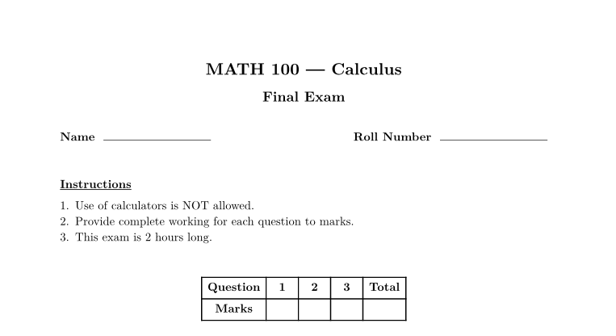
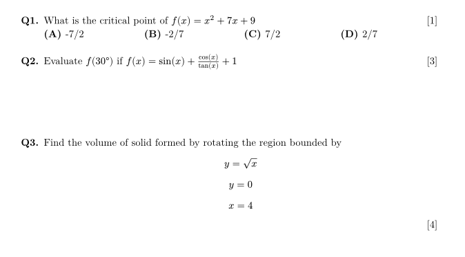
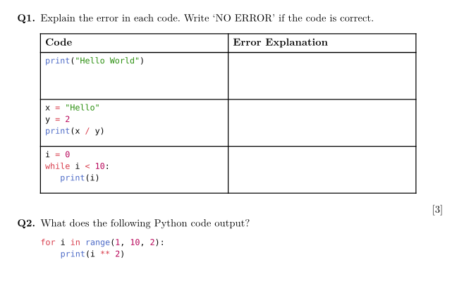

As teaching assistant, I often had to create quizzes and assignments that followed an exact same format and it
eventually became a bit repetitive. So as a programmer, I had to spend 3-4 hours streamlining a task that takes
5 minutes normally.

So, presenting **MakeXam**, a simple exam generation tool powered by [Typst](https://typst.app) 🚀

# Typst, typesetting for humans
MakeXam is powered by Typst, a typesetting tool similar to LaTeX. Unlike LaTeX however, Typst features a less
confusing syntax that uses standard and "familiar programming constructs instead of hard-to-understand macros." This
can be seen in this example:

(I know it's ironic to have uppercase "X" in makeXam while ranting about LaTeX)

MakeXam has a [Typst template](https://github.com/izxxr/makeXam/blob/main/public/plain.typ) that it injects values
into to generate the exam document. We use the [typst.ts](https://myriad-dreamin.github.io/typst.ts/cookery/introduction.html) library to render live preview of exam and compile the Typst template code into PDF document. [[src]](https://github.com/izxxr/makeXam/blob/main/src/sections/Preview.tsx)

# Features
MakeXam provides a simple way of generating exams and right now, it includes the following features

**Standard Exam Elements**

MakeXam provides all the ability to include all standard assessment elements. From guidelines, custom
input fields such as name and roll number, to grading table.

**Question Types and Format**

Currently, multiple choice question (MCQ) is available as an additional question type in MakeXam. More
question types will be added in future.

Each question can have specific marks displayed besides the question and custom length of space for
providing any working.

**Responsive Layout**

The exam layout is designed to carefully take responsiveness into account. Got large number of questions with
MCQ having more than 4 choices? No worries, MakeXam can take care of that.

The layout is responsive to all kinds of formats and can effectively handle most formatting quirks.

**Markup Elements**

MakeXam evaluates question content as Typst markup code. This means all Typst markup elements, such as *equations,
code blocks, tables, figures, etc. are fully supported.*

To include these elements, check the documentation on [Typst's syntax](https://typst.app/docs/reference/syntax/).

**Live Preview & PDF Export**

Thanks to typst.ts, makeXam provides live preview of exam as you make changes right in your browser.

Once you're done, export a high quality PDF, ready to be printed!

---

# Source
MakeXam is open source. Feel free to checkout the code and contribute to it at https://github.com/izxxr/makeXam

Got a feature idea? [Open an issue!](https://github.com/izxxr/makeXam/issues/new)
